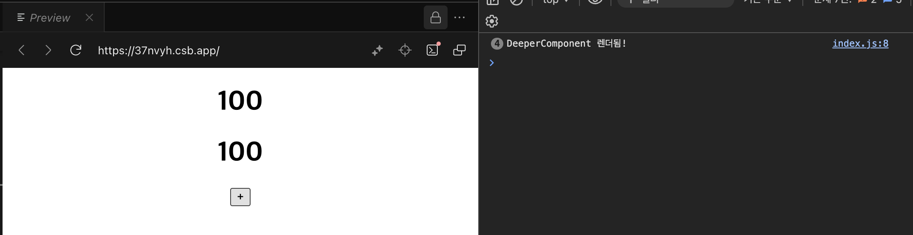

# 01. 리액트 개발을 위해 꼭 알아야 할 자바스크립트

- 단순히 리액트 코드를 작성하는 것이 아닌 리액트가 수행하는 작업을 이해하기 위한 최소한의 자바스크립트를 다룬다.

## 1.1 자바스크립트의 동등 비교

- 동등 비교를 배우는 이유는 가상 DOM과 실제 DOM의 비교, 컴포넌트가 렌더링할지 판단하는 방법, 변수나 함수의 메모이제이션 등을 자바스크립트의 동등 비교를 기반으로 하기 때문이다.

### 1.1.1 자바스립트의 데이터 타입

#### 원시 타입

- undefined

  - 선언 후 값을 할당하지 않은 변수, 값이 주어지지 않은 인수에 자동으로 할당되는 값.

- null

  - 값이 없거나 비어있는 값을 표현할 때 사용.
  - 특이한 점으로 `typeof null`을 하면 `object`가 반환된다.
  - `undefined`는 선언을 했지만 할당되지 않은 값, `null`은 명시적으로 비어있는 값을 표현할 때 일반적으로 사용한다.

- Boolean

  - `true` 또는 `false`만 갖을 수 있는 데이터 타입.
  - 자바스크립트에서는 조건문 내부에서 `true`로 판단되는 `truthly`, `false`로 판단되는 `falsy`가 있다.
  - `falsey`는 `false`, 0(`0`, `-0`), `NaN`, 빈 문자열("", '', ``), `undefined`, `null`이 있다.
  - `truthly`는 `falsy`를 제외한 모든 것으로 배열이나 객체일 경우 요소가 비어있어도 `true`로 취급한다.

- Number

  - `-(2^53 - 1) ~ 2^53 -1`까지의 숫자를 표현할 수 있다.
  - ES6 이전에 유일하게 숫자를 나타내는 데이터 타입으로 정수와 실수를 구분하지 않고 2진수, 8진수, 12진수 등의 별도 데이터 타입을 제공하지 않으므로 모두 10진수로 표현한다.

- Bigint

  - ES2020에 새롭게 추가된 숫자형으로 `number`에서 표현할 수 있는 숫자보다 더 큰 범위의 숫자를 갖을 수 있다.

- String

  - 텍스트 타입의 데이터를 표현하는 데이터 타입으로 한 번 선언된 문자열은 불변성을 갖는다.
  - '', ""와 달리 ``는 템플릿 리터럴이라고 불리며 내부에서 줄바꿈, 표현식을 사용할 수 있다.

- Symbol
  - ES6에 새로 추가된 타입으로 고유한 값을 나타내는 데이터 타입으로 `Symbol` 메서드에 의해서만 선언될 수 있다.

#### 객체 타입

- 원시 타입를 제외한 모든 데이터 타입으로 클래스, 배열, 함수, 정규식 등이 있다.
- 참조를 전달하여 참조형 데이터라고도 불리며 여기서 자바스크립트 동등 비교의 특징이 나타난다.

### 1.1.2 값을 저장하는 방식의 차이

- 원시 타입과 객체 타입의 가장 큰 차이점은 값을 저장하는 방식으로 동등 비교를 할 때 차이를 만드는 원인이 된다.
- 원시 타입: 불변 형태의 값으로 저장되며 복사 시에 값을 복사하여 전달한다.
- 객체 타입: 변경 가능한 상태로 저장되며 복사 시에 값이 아닌 참조를 전달한다.

  - 객체 간의 비교는 대부분 `true`가 아닐 수 있다는 것을 인지해야 한다.

  ```js
  console.log([1, 2, 3] === [1, 2, 3]); // false

  const objA = { comment: "hi" };
  const objB = objA;
  console.log(objA === objB); // true
  ```

### 1.1.3 자바스크립트의 또 다른 비교 공식, Object.is

- 두 개의 인수를 받아 두 개가 동일한지 확인하고 반환하는 메서드
- `==`와의 차이점: `==`는 비교 전에 강제 타입 변환이 일어나지만 `Object.is`는 강제 타입 변환이 이뤄지지 않는다.
- `===`와의 차이점: `===`는 `0`과 `-0`, `NaN`과 `NaN`을 비교하지 못하지만 `Object.is`는 정확히 비교해준다.
- 주의할 점으로 객체는 정확하게 비교하지 못한다.

### 1.1.4 리액트에서의 동등 비교

- 리액트에서는 `Object.is`를 사용하여 동등 비교를 한다.
- 리액트에서 동등 비교 시 사용하는 `shallowEqual`의 비교 과정은 아래와 같다.
  - `Object.is`로 먼저 비교를 수행한다.
  - 객체의 얕은 비교를 수행, 얕은 비교란 첫 번째 깊이에 존재하는 값만 비교한다는 의미다.
- 객체의 얕은 비교를 수행하는 이유는 `JSX`의 `props`는 객체이고, `props`만 일차적으로 비교하면 되기 때문이다.
- 이러한 특징을 안다면 `props`에 또 다른 객체를 넘겨준다면 리액트 렌더링이 예상치 못하게 작동한다는 것을 알 수 있다.

  ```jsx
  import { memo, useEffect, useState } from "react";
  import "./styles.css";

  const Component = memo((props) => {
    useEffect(() => {
      console.log("Component 렌더됨!");
    });

    return <h1>{props.counter}</h1>;
  });

  const DeeperComponent = memo((props) => {
    useEffect(() => {
      console.log("DeeperComponent 렌더됨!");
    });

    return <h1>{props.counter.counter}</h1>;
  });

  export default function App() {
    const [, setCounter] = useState(0);

    function handleClick() {
      setCounter((prev) => prev + 1);
    }

    return (
      <div className="App">
        <Component counter={100} />
        <DeeperComponent counter={{ counter: 100 }} />
        <button onClick={handleClick}>+</button>
      </div>
    );
  }
  ```

  

  - DeeperComponent의 props가 변경되지 않았음에도 버튼 클릭 시 렌더링이 되고 있다

- 만약 내부에 있는 객체까지 재귀함수로 깊은 비교한다면 성능에 악영향을 미칠 것이다.

### 1.1.5 정리

- 자바스크립트에서 객체 비교의 불완전성을 잘 숙지하면 훅의 의존성 배열의 비교, 렌더링 방지를 넘어선 `useMemo`와 `useCallback`의 필요성, 렌더링 최적화를 위해서 꼭 필요한 `React.memo`를 올바르게 작동시키기 위해 고려해야 할 것들을 이해할 수 있다.

## 1.2 함수

## 1.3 클래스

## 1.4 클로저

## 1.5 이벤트 루프의 비동기 통신의 이해

## 1.6 리액트에서 자주 사용하는 자바스크립트 문법

## 1.7 선택이 아닌 필수, 타입스크립트
